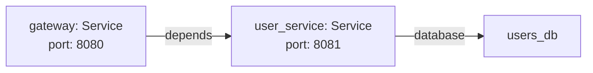

# Markdown to Graph [[markdown_to_graph: Explanation]]

- goal: see how plain Markdown headings and lists become a queryable graph
- audience: newcomer
- about: [[#object]], [[#field]], [[#reference]], [[#heading]], [[#array]], [[#workspace]]
- next: [[#human_machine_readable]]

## Content Generator [[markdown_to_graph_gen: ContentGenerator]]

- target: [[#markdown_to_graph.content]]
- about: [[#object]], [[#field]], [[#reference]], [[#heading]], [[#array]], [[#workspace]]
- sources_hash: 3af29125a12265aa

### Prompt [[markdown_to_graph_gen_prompt: text]]

Explain how QMDC turns plain Markdown into a queryable graph. This is the "aha moment" page.

Structure:

1. Start with a familiar Markdown document (headings, lists, links)
2. Show how QMDC interprets it: headings → objects, lists → fields, `[[#ref]]` → edges
3. Show the resulting graph visually (describe nodes and edges in text, or use a simple mermaid diagram)
4. Show a SQL query against the graph: "find all objects that reference X"
5. Explain: the Markdown IS the database. No export, no sync, no drift.

Key insight to convey: you're not "annotating" Markdown — you're writing Markdown that happens to be structured. The structure emerges from conventions you already use (headings for sections, lists for properties).

Use concrete examples from the format specification objects.

## Content [[content: text]]

You already know how to write Markdown. Headings, bullet lists, links — that's all QMDC needs to build a queryable graph. No special tooling, no export step, no schema files. The Markdown **is** the database.

## Start with familiar Markdown

Here's a document describing two services:

```qmd
## API Gateway [[gateway: Service]]

- port: 8080
- depends: [[#user_service]]

## User Service [[user_service: Service]]

- port: 8081
- database: [[#users_db]]
```

Nothing exotic — headings, bullet lists, and a couple of `[[...]]` annotations. But QMDC sees structure here.

## How QMDC interprets it

Each Markdown element maps to a graph concept:

| Markdown element | Graph concept |
|-----------------|---------------|
| Heading with `[[id: Kind]]` | [[#object]] — a node in the graph |
| `- key: value` list items | [[#field]] — data on that node |
| `[[#id]]` in a value | [[#reference]] — a typed edge to another node |
| [[#heading]] level (H1→H6+) | Nesting — parent-child relationships |

From the document above, QMDC produces:

- Two **object** nodes: `gateway` and `user_service`, both of Kind `Service`
- **Fields** on each: `port`, `depends`, `database`
- **Edges**: `gateway →depends→ user_service`, `user_service →database→ users_db`

## The resulting graph



Every edge carries a **type** — the field name that holds the reference. `depends`, `database`, `author` — these aren't generic "links," they're semantically meaningful relationships you defined by naming your fields.

## Query it with SQL

Once parsed, query the graph directly:

```sql
-- Find everything that depends on user_service
SELECT source_id, edge_type FROM edges WHERE target_id = 'user_service'
```

Result: `gateway` depends on `user_service`.

```sql
-- Get all Service objects and their ports
SELECT __id, json_extract(data, '$.port') as port
FROM objects WHERE __kind = 'Service'
```

Result: `gateway: 8080`, `user_service: 8081`.

No export. No sync. No drift between your docs and your data.

## The key insight

You're not "annotating" Markdown with metadata. You're writing Markdown that **happens to be structured** — and the structure emerges from conventions you already use:

- **Headings** for sections → become [[#object]] nodes
- **Bullet lists** for properties → become [[#field]] data
- **Links** between things → become [[#reference]] edges

Add `[[id]]` to a heading and it becomes addressable. Add `[[#target]]` to a field value and it becomes a graph edge. That's it.

## Nesting creates hierarchy

Subheadings express parent-child relationships and [[#array]] collections:

```qmd
## Team [[team]]

### Members [[members: [User]]]

#### Alice [[alice]]

- role: admin

#### Bob [[bob]]

- role: dev
```

This creates a `team` object with a `members` array containing two `User` objects. Each child automatically gets `__parent: [[#team]]` and `__parent_field: members` — no manual wiring needed. The child IDs become hierarchical: `team.members.alice`, `team.members.bob`.

## The whole workspace is the graph

A [[#workspace]] is a directory of `.qmd.md` files. References work across files — `[[#user_service]]` resolves whether the target is in the same file or a different one. The parser indexes every object, validates all references, and reports broken links.

Your file system is your namespace. Your Markdown is your schema. Your headings are your nodes. There's nothing else to maintain.

---

For complete syntax details — objects, fields, references, arrays, and workspaces — see the [Format Specification](../format/index.md).
