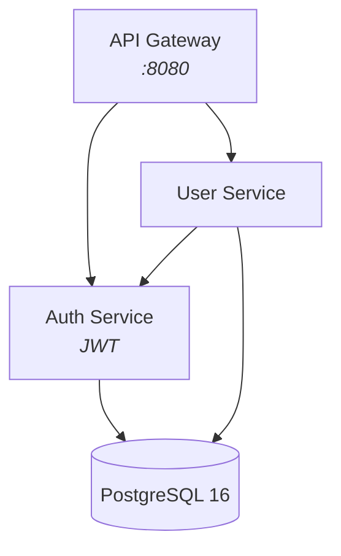
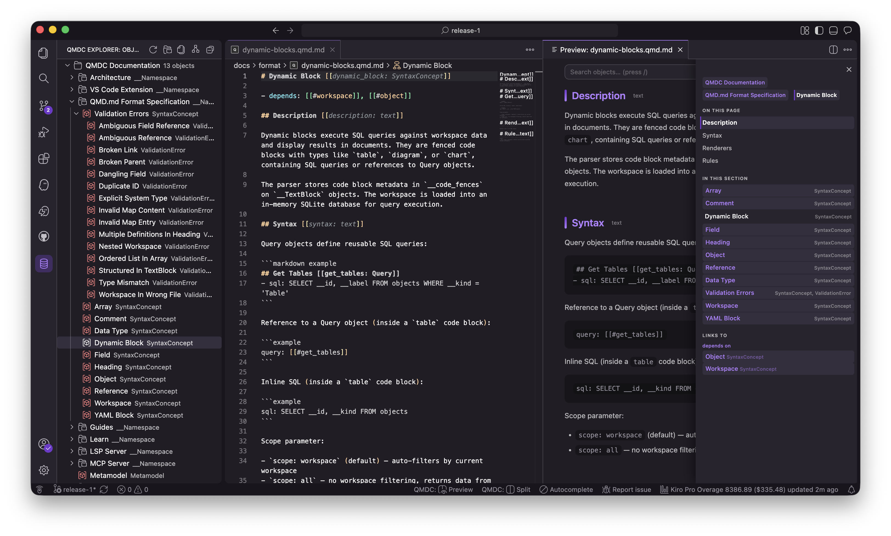

# QMDC — A Markdown-native context graph for humans and agents

Human-readable docs. Machine-queryable graph. Agent-ready context.


<!-- [](https://github.com/mikilabs/qmdc/actions/workflows/ci.yml) -->
[](https://pypi.org/project/qmdc/)
[](https://crates.io/crates/qmdc)
[](https://www.npmjs.com/package/@qmdc/qmdc)
[](https://marketplace.visualstudio.com/items?itemName=MiKiLabs.qmdc-vscode)
[](https://open-vsx.org/extension/mikilabs/qmdc-vscode)
[](https://github.com/mikilabs/qmdc/blob/main/LICENSE)

!!! warning "Alpha release"
    QMDC is early and moving fast — the format, APIs, and tooling may still change, and some edges will be rough or broken. If something doesn't work, please [open an issue](https://github.com/mikilabs/qmdc/issues). Bug reports and feedback are hugely welcome.

QMDC turns your documentation into a knowledge graph — without leaving Markdown. Headings become objects, list items become fields, and `[[#references]]` create typed edges. The result is one source of truth with three audiences: humans read it as Markdown, machines query it with SQL, and agents navigate it over MCP.

## QMD.md vs QMDC

**QMD.md** is the *format* — the Markdown convention you write, stored in `.qmd.md` files. **QMDC** is the *toolchain* that reads it: the `qmdc` CLI, the `qmdc-py` / `qmdc-ts` / `qmdc-rs` parsers, the VS Code extension, and the documentation-site generator. In short — you author **QMD.md**; **QMDC** parses, validates, and queries it. The file extension stays `.qmd.md`.

## Install

```bash
uvx qmdc --help        # PyPI (bundles the native binary)
npx @qmdc/qmdc --help  # npm (bundles the native binary)
cargo install qmdc     # crates.io (builds from source)
```

Editor support: the **[VS Code extension](extension/index.md)** ships on the [VS Code Marketplace](https://marketplace.visualstudio.com/items?itemName=MiKiLabs.qmdc-vscode) and [Open VSX](https://open-vsx.org/extension/mikilabs/qmdc-vscode).

## Get Started

- :material-rocket-launch:{ .lg } **[Quickstart](tutorials/quickstart.md)** — Install, create a file, parse it, query it — 5 minutes.
- :material-head-question:{ .lg } **[Why QMDC?](learn/why-qmdc.md)** — What problem does QMDC solve and who is it for.
- :material-graph:{ .lg } **[Markdown → Graph](learn/markdown-to-graph.md)** — How headings and lists become a queryable knowledge graph.
- :material-robot:{ .lg } **[QMDC for Agents](learn/qmdc-for-agents.md)** — Give your AI coding assistant structured context.
- :material-server-network:{ .lg } **[MCP Server](mcp/index.md)** — Expose your project graph to AI agents over the Model Context Protocol (`qmdc mcp`): search, SQL, graph walks, rename.
- :material-microsoft-visual-studio-code:{ .lg } **[VS Code Extension](extension/index.md)** — LSP-powered editing, live preview, SQL queries. Install from the [VS Code Marketplace](https://marketplace.visualstudio.com/items?itemName=MiKiLabs.qmdc-vscode) or [Open VSX](https://open-vsx.org/extension/mikilabs/qmdc-vscode).

## Tutorials

Learn QMDC by doing:

- [Quickstart](tutorials/quickstart.md) — zero to a working graph in 5 minutes
- [Write Your First QMD.md File](tutorials/first-file.md) — a detailed lesson with explanations

## How-to Guides

Recipes for specific tasks:

- [Validate a Document](guides/validate-document.md) — check for errors and fix them
- [Query Your Graph](guides/query-graph.md) — SQL queries against your workspace
- [Build a Workspace](guides/small-workspace.md) — multi-file project from scratch
- [Use with VS Code](guides/vscode.md) — IDE integration with diagnostics and navigation

## Reference

- [Format Specification](format/index.md) — complete syntax reference (objects, fields, references, arrays, types)
- [CLI Commands](parsers/commands.md) — `qmdc parse`, `validate`, `query`, `rebuild`
- [VS Code Extension](extension/index.md) — commands, settings, views
- [LSP Server](lsp/index.md) — diagnostics, completion, navigation, refactoring

## How It Works

<div class="grid" markdown>

```qmd.md
## API Gateway [[gateway: Service]]

- port: 8080
- depends: [[#auth]], [[#users]]

## Auth Service [[auth: Service]]

- protocol: JWT
- database: [[#postgres]]

## User Service [[users: Service]]

- depends: [[#auth]]
- database: [[#postgres]]

## PostgreSQL [[postgres: Resource]]

- version: 16
```



</div>

One file. One parse. A queryable graph with typed edges — `depends`, `database`, `protocol` — all from plain Markdown.

Then query it like a database:

```sql
SELECT source_id, target_id FROM edges WHERE edge_type = 'depends'
```

| source_id | target_id |
|-----------|-----------|
| gateway | auth |
| gateway | users |
| users | auth |

Three parsers (Python, TypeScript, Rust). VS Code extension with LSP. SQL queries over your docs.


