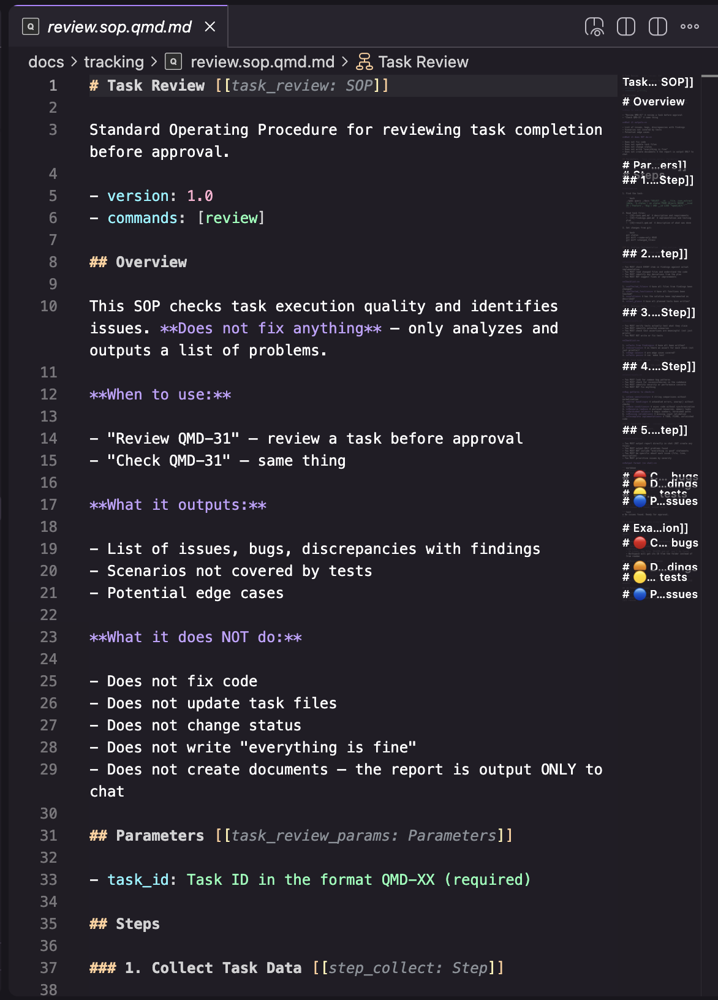
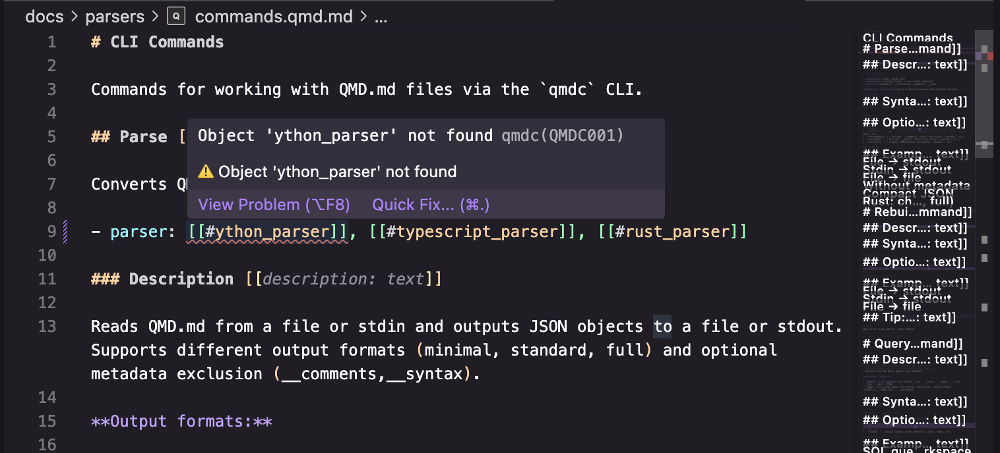
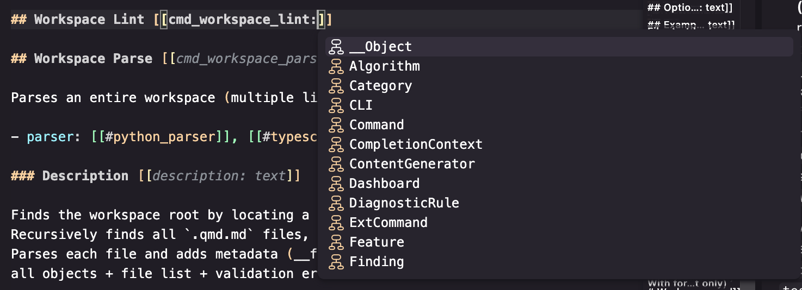
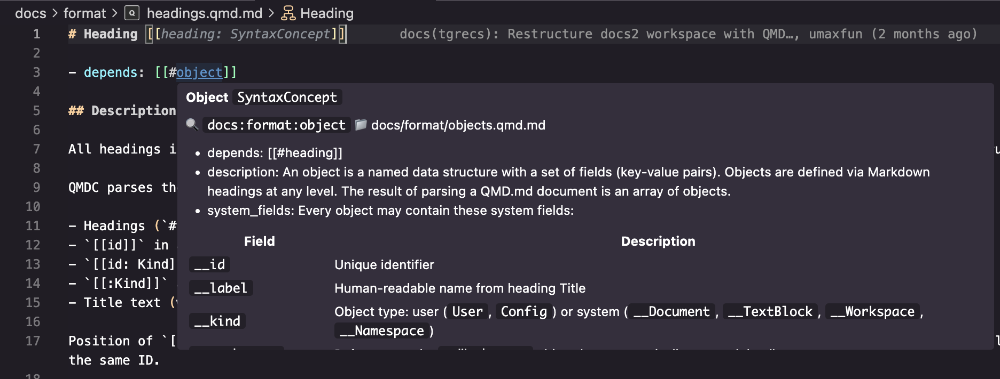
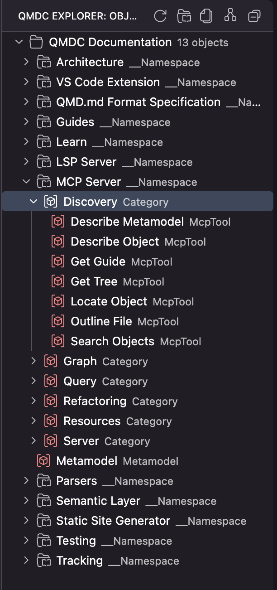
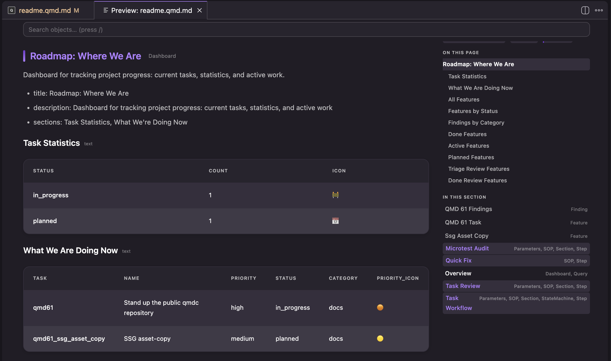
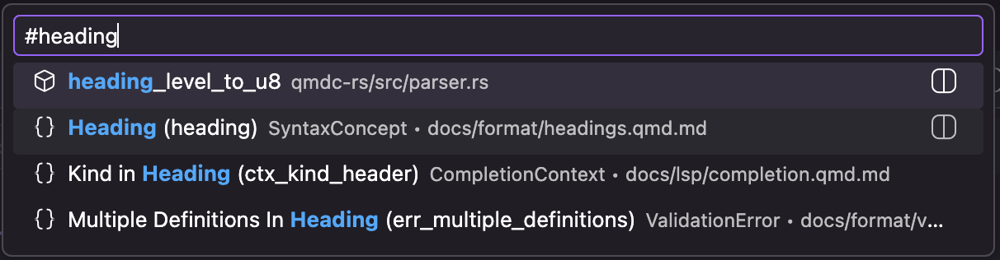
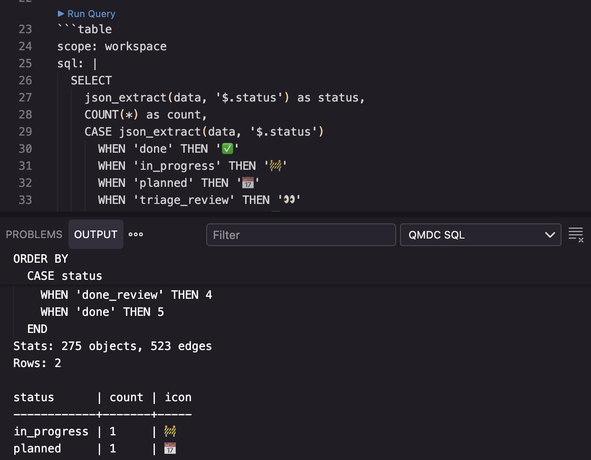

# Screenshots — Tracking (TEMP)

Temporary tracking page for the docs media pass. **Delete before release.**

How to use:

1. Take each screenshot below and save it to the exact `Path` shown (under `docs/assets/`).
2. As soon as a file lands at its path, its preview below stops being a broken image — that's your visual "done" signal.
3. To preview this page: VS Code built-in Markdown preview (`Cmd+Shift+V`) renders the images immediately. The QMDC extension preview will render them too once the image-render fix lands.
4. Each item lists the destination doc page + section where I'll embed the final ``.

Legend: ☐ = not shot yet · ☑ = file in place

Note: images only appear on the built site (qmdc.mikilabs.io) after the SSG asset-copy fix; the in-editor previews above work regardless.

---

## Tier 1 — required (core visual features)

### 1. Hero — editor + preview side-by-side ☐

- Path: `assets/hero.png`
- Shows: a `.qmd.md` file open in VS Code with the QMDC rendered preview beside it (highlighting on the left, rendered graph/refs on the right).
- Goes: `docs/readme.md` (landing page, top, under the intro line).

### 2. Syntax highlighting ☐

- Path: `assets/vscode-highlighting.png`
- Shows: a `.qmd.md` file with color-coded object IDs, Kinds, `[[#refs]]`, and fields.
- Goes: `docs/guides/vscode.qmd.md` → "What You Get Immediately".

### 3. Diagnostics (broken link) ☐

- Path: `assets/vscode-diagnostics.png`
- Shows: a red squiggle under a broken `[[#nonexistent]]` ref + the Problems panel showing `QMDC001`.
- Goes: `docs/guides/vscode.qmd.md` → "Diagnostics" (replaces the ASCII art).

### 4. Autocomplete popup ☐

- Path: `assets/vscode-autocomplete.png`
- Shows: typing `[[#` with the completion list of object IDs.
- Goes: `docs/guides/vscode.qmd.md` → "Autocomplete" (replaces the ASCII art).

### 5. Hover tooltip ☐

- Path: `assets/vscode-hover.png`
- Shows: hovering a `[[#id]]` → tooltip with label, Kind, file, and fields.
- Goes: `docs/guides/vscode.qmd.md` → "Hover".

### 6. QMDC Objects Explorer ☐

- Path: `assets/vscode-explorer.png`
- Shows: the activity-bar QMDC Explorer tree (workspaces → namespaces → objects).
- Goes: `docs/guides/vscode.qmd.md` → "QMDC Explorer Panel" AND `docs/extension/readme.qmd.md` → "QMDC Objects Explorer".

### 7. Preview panel ☐

- Path: `assets/vscode-preview.png`
- Shows: the rendered preview with a mermaid diagram, an executed `table` block, and clickable `[[#ref]]` links.
- Goes: `docs/guides/vscode.qmd.md` → "Preview Panel" AND `docs/extension/readme.qmd.md` → "QMDC Preview".

### 8. Go to Object quick-pick ☐

- Path: `assets/vscode-goto-object.png`
- Shows: the `Cmd+Shift+O` searchable object list (filter by ID/label/Kind).
- Goes: `docs/guides/vscode.qmd.md` → "Workspace Navigation".

---

## Tier 2 — high value

### 9. Generated site (self-shot) ☐

- Path: `assets/ssg-site.png`
- Shows: this docs site with the graph sidebar + a semantic-hint popover + a rendered `table` block.
- Goes: `docs/ssg/readme.qmd.md` → "Features".

### 10. Run SQL Query output ☐

- Path: `assets/vscode-sql-output.png`
- Shows: the "QMDC SQL" output channel after running a query (or a rendered `table` block in the preview).
- Goes: `docs/guides/query-graph.qmd.md` (optional polish).

---

## Tier 3 — nice to have

### 11. Quickstart terminal ☐

- Path: `assets/quickstart-terminal.png`
- Shows: a terminal running `qmdc parse` / `qmdc query` with real output.
- Goes: `docs/tutorials/quickstart.qmd.md` (optional).

---

## Not screenshots (handled separately)

- `docs/lsp/visual.qmd.md` — all features are `status: planned`; no screenshots.
- `docs/learn/why-qmdc.qmd.md` and Architecture — candidate for authored **mermaid** diagrams (no screenshot needed); I can add those in-place.
