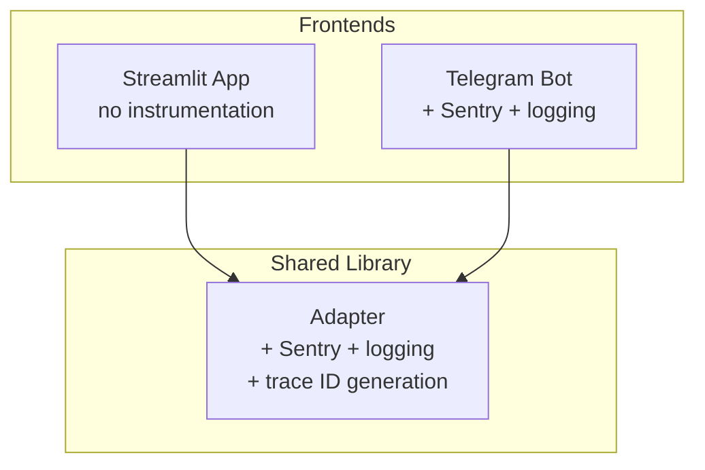

## Architecture

```mermaid
graph TD
    subgraph "Frontends"
        ST[Streamlit App<br/>no instrumentation]
        TG[Telegram Bot<br/>+ Sentry + logging]
    end

    subgraph "Shared Library"
        AD[Adapter<br/>+ Sentry + logging<br/>+ trace ID generation]
    end

    ST --> AD
    TG --> AD
```
