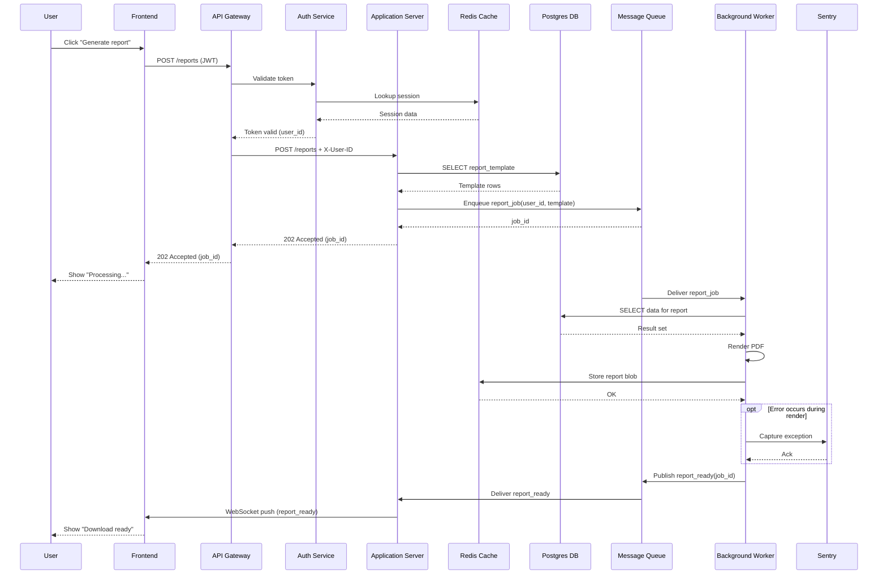

## Large Flow

```mermaid
sequenceDiagram
    participant U as User
    participant FE as Frontend
    participant GW as API Gateway
    participant AUTH as Auth Service
    participant APP as Application Server
    participant CACHE as Redis Cache
    participant DB as Postgres DB
    participant Q as Message Queue
    participant WORK as Background Worker
    participant SEN as Sentry

    U->>FE: Click "Generate report"
    FE->>GW: POST /reports (JWT)
    GW->>AUTH: Validate token
    AUTH->>CACHE: Lookup session
    CACHE-->>AUTH: Session data
    AUTH-->>GW: Token valid (user_id)
    GW->>APP: POST /reports + X-User-ID
    APP->>DB: SELECT report_template
    DB-->>APP: Template rows
    APP->>Q: Enqueue report_job(user_id, template)
    Q-->>APP: job_id
    APP-->>GW: 202 Accepted (job_id)
    GW-->>FE: 202 Accepted (job_id)
    FE-->>U: Show "Processing..."

    Q->>WORK: Deliver report_job
    WORK->>DB: SELECT data for report
    DB-->>WORK: Result set
    WORK->>WORK: Render PDF
    WORK->>CACHE: Store report blob
    CACHE-->>WORK: OK

    opt Error occurs during render
        WORK->>SEN: Capture exception
        SEN-->>WORK: Ack
    end

    WORK->>Q: Publish report_ready(job_id)
    Q->>APP: Deliver report_ready
    APP->>FE: WebSocket push (report_ready)
    FE-->>U: Show "Download ready"
```
