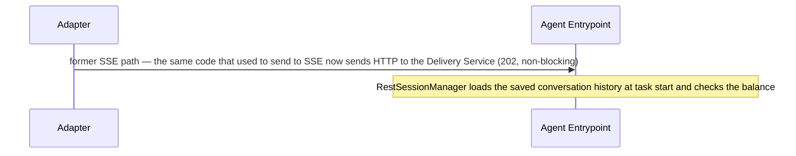

## Flow with long labels

```mermaid
sequenceDiagram
    participant AD as Adapter
    participant APP as Agent Entrypoint
    AD->>APP: former SSE path — the same code that used to send to SSE now sends HTTP to the Delivery Service (202, non-blocking)
    Note over APP: RestSessionManager loads the saved conversation history at task start and checks the balance
```
