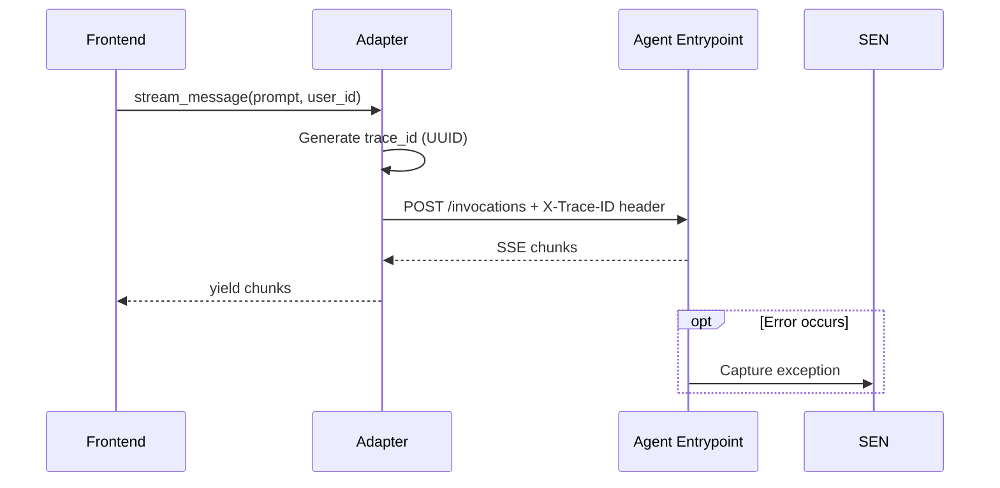

## Flow

```mermaid
sequenceDiagram
    participant FE as Frontend
    participant AD as Adapter
    participant APP as Agent Entrypoint

    FE->>AD: stream_message(prompt, user_id)
    AD->>AD: Generate trace_id (UUID)
    AD->>APP: POST /invocations + X-Trace-ID header
    APP-->>AD: SSE chunks
    AD-->>FE: yield chunks

    opt Error occurs
        APP->>SEN: Capture exception
    end
```
