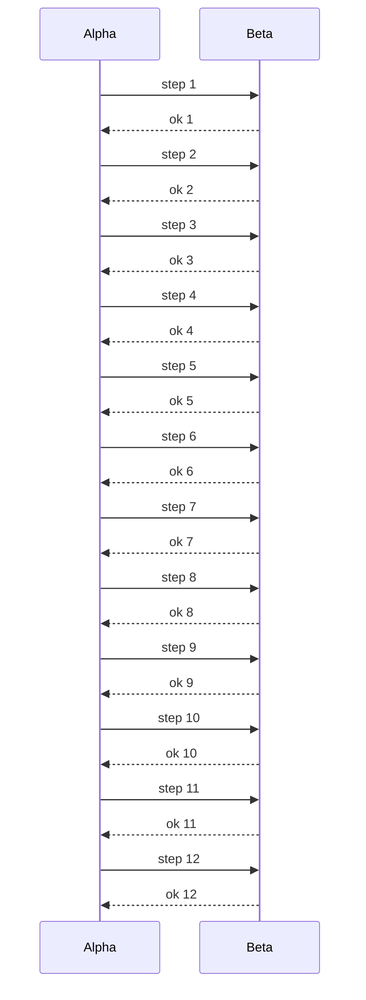

## Tall Flow

```mermaid
sequenceDiagram
    participant A as Alpha
    participant B as Beta
    A->>B: step 1
    B-->>A: ok 1
    A->>B: step 2
    B-->>A: ok 2
    A->>B: step 3
    B-->>A: ok 3
    A->>B: step 4
    B-->>A: ok 4
    A->>B: step 5
    B-->>A: ok 5
    A->>B: step 6
    B-->>A: ok 6
    A->>B: step 7
    B-->>A: ok 7
    A->>B: step 8
    B-->>A: ok 8
    A->>B: step 9
    B-->>A: ok 9
    A->>B: step 10
    B-->>A: ok 10
    A->>B: step 11
    B-->>A: ok 11
    A->>B: step 12
    B-->>A: ok 12
```
